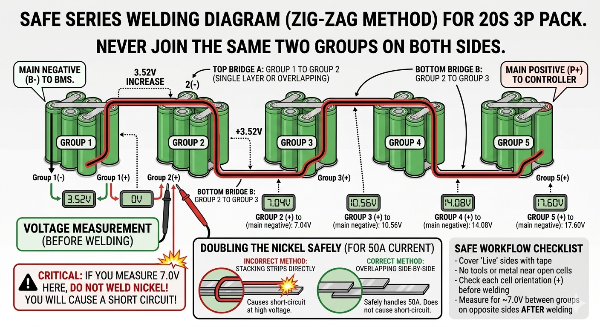
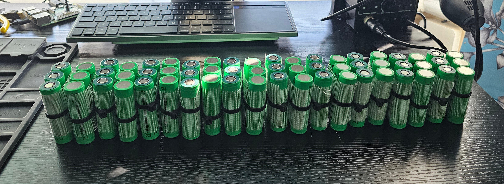
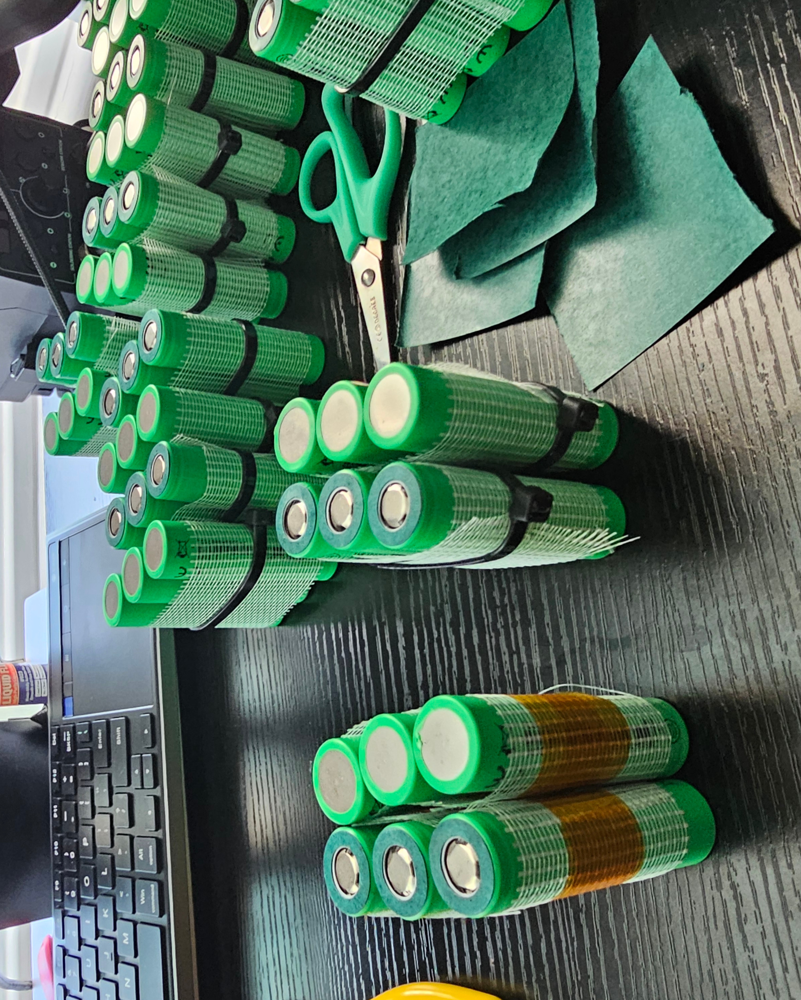
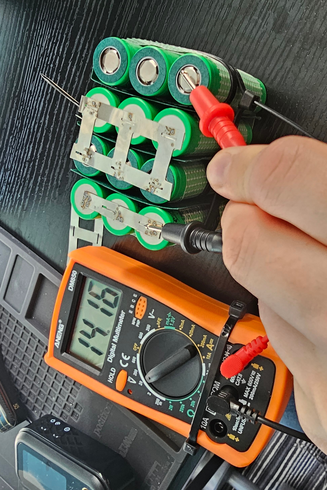

## Why would you want to do this?
I am doing this because it would be a very good learning experience and teach me a BUNCH of stuff about electronics and batteries as well as (hopefully) build something that can actually move around.

Batteries are often the most expensive part of the entire build - building these yourself 
can save some money but at a risk of starting a fire. 

The parts are still pretty expensive but nowhere near the cost of a new e-bike - plus I can modify this however I want, something that the store-bought e-bikes mostly cannot without the same or more work than converting / building one yourself. I can also go however fast I want (while not neccessarily legal in the UK to go above 30 MPH (average UK law nowadays - no fun allowed!) - it still has the possibility to do so which I like). 

## Parts
Here is a list of the parts that I have bought in order to build the bike: 
 
- [x] Bike (any bike / bike frame with wheels & gears etc...)
- [x] Motor (mine is a kunray 72V 3000W brushless motor)
- [x] Controller (came with the motor)
- [x] Battery (either pre-built or made yourself - I did the latter option)
- [x] Cells (if making the battery yourself (I chose the 18650 EVE 25SP 2500mAh 20A batteries))
- [x] 2x XT-S 90 connectors (For connecting the; charger, battery and controller easily)
- [x] Pure nickel strips 2.0 mm (we need thicker than normal as we are pushing a large amount of energy through it.

## Making the battery
To power the controller, motor and everything else, we need quite a powerful battery - since I did not buy a pre-made one (as they are very expensive) I bought the batteries, BMS (Battery Management System) and all materials (kapton & fibreglass taple for some structural support).

The basic grouping I am going to use the batteries are to use 3 batteries in a group and zig-zag them so we have one side with a negative terminal and another side with a positive terminal for the whole battery pack (see diagram below).

### Grouping the cells
The cells are going to be in groups of 3 and flipped after every group. To get them together and not fall apart I origininally used fibreglass tape and zip-ties to hold them together, but while welding I found that there was too much space left inbetween the batteries due to the zip-ties to so I used kapton tape to hold the groups together which worked much better as the batteries could sit pretty-much flush with each other.

Orginal grouping (all cells with zip-ties):

After welding and realising I need to change to kapton tape:

Before I changed the zip-ties, I welded 4 groups together and was reciving the correct voltage:

I was very pleased with this as the cells had not blown up and the voltage is looking correct - with the changed kapton tape, I then attempted to weld all of the batteries to get the first major step which is correctly welding all the cells together to make one large battery.
However, after welding all of the batteries together, moving it around would put too much strain on the welds and they would pop off just moving the battery around - this was an issue that just re-welding them back on would not stop them from snapping off again as the batteries are pretty heavy compated to the welds.
So after spot-welding all the nickel onto the battery, I had to rip it all off and start anew. I have decided to use hot glue for the groups of 3 cells and then more glue + tape to get the cells more structurally stable. This is a very important part that I completely missed - if the battery cannot hold up to simple manipulation,
e.g. picking it up and roatating it around - there's pretty much no chance it will survive a ride on a bike.

As-of-writing I am still in the process of re-spot-welding all of the nickel plating (&doubling them up) and making sure that the plating does not pop off as the battery should be more structurally sound / secure than just the (very) flimsy spot welds.

TODO: 
- [ ] Talk more about first welding and provide images of successful volatage.
- [ ] Explain the structural issues causing too much tension on the welds and them popping off.

