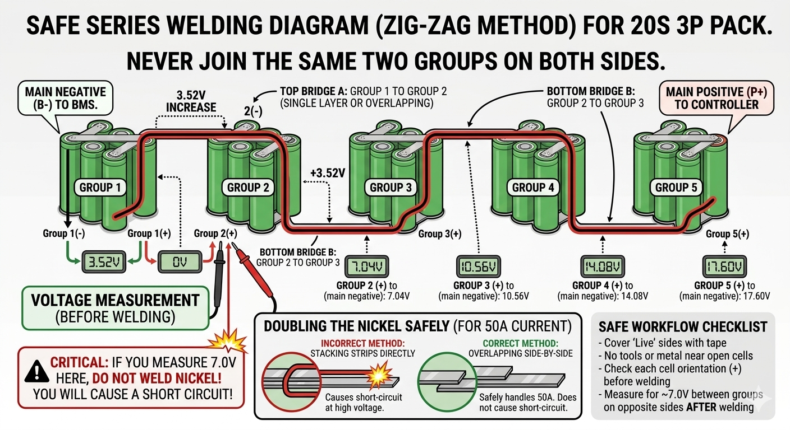
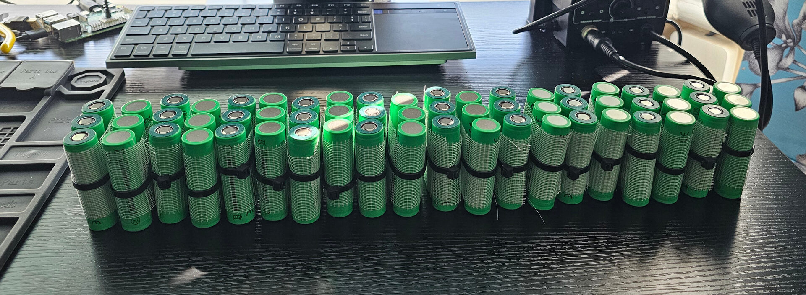
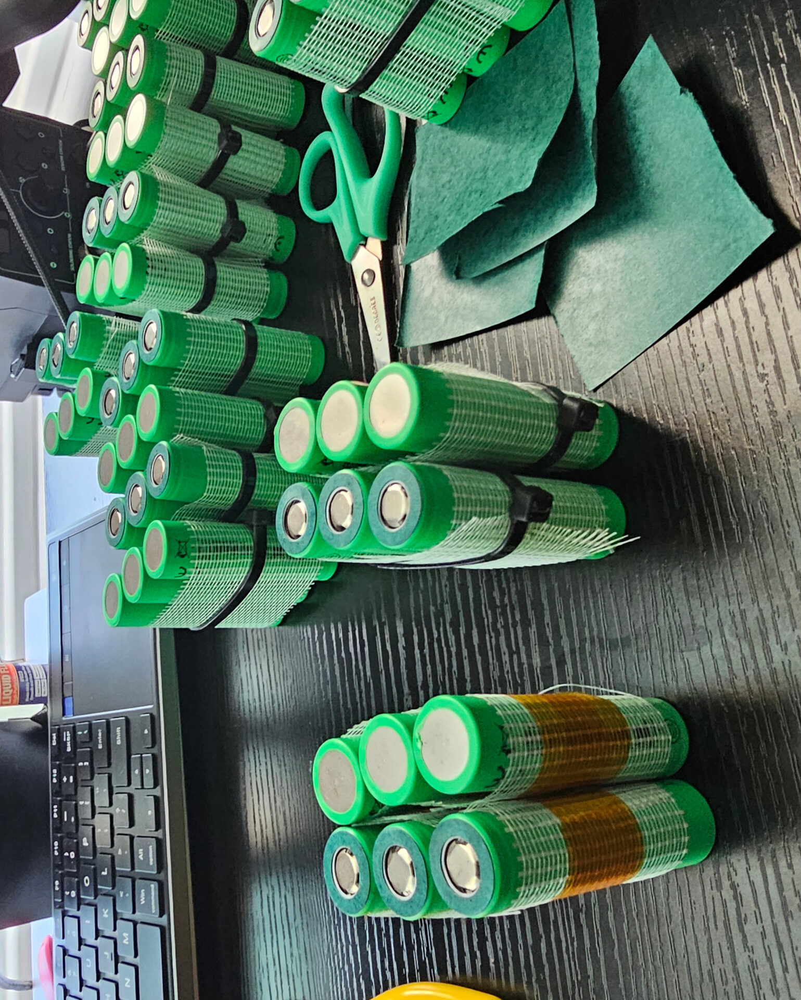
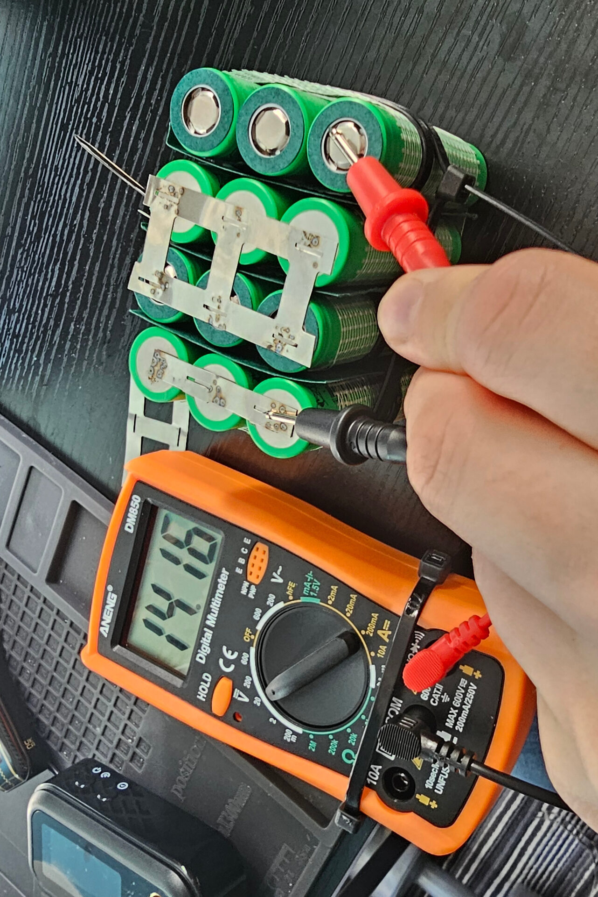
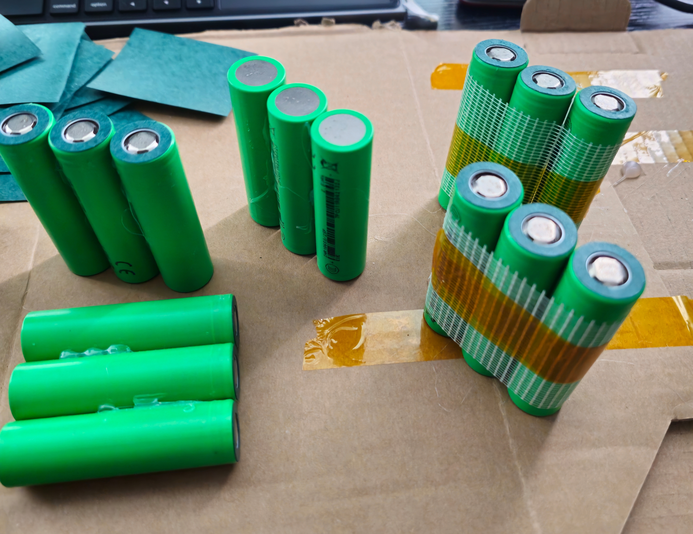

## Why would you want to do this?
I am doing this because it would be a very good learning experience and teach me a BUNCH of stuff about electronics and batteries as well as (hopefully) build something that can actually move around.

Batteries are often the most expensive part of the entire build - building these yourself 
can save some money but at a risk of starting a fire. 

The parts are still pretty expensive but nowhere near the cost of a new e-bike - plus I can modify this however I want, something that the store-bought e-bikes mostly cannot without the same or more work than converting / building one yourself. I can also go however fast I want (while not necessarily legal in the UK to go above 30 MPH (average UK law nowadays - no fun allowed!) - it still has the possibility to do so which I like). 

## Parts
Here is a list of the parts that I have bought in order to build the bike: 
 
- [x] Bike (any bike / bike frame with wheels & gears etc...)
- [x] Motor (mine is a kunray 72V 3000W brushless motor)
- [x] Controller (came with the motor)
- [x] Battery (either pre-built or made yourself - I did the latter option)
- [x] Charger for the battery (my one is 84v, 5A)
- [x] Cells (if making the battery yourself (I chose the 18650 EVE 25SP 2500mAh 20A batteries))
- [x] 4x XT-S 90 (2x male & 2x female) connectors (For connecting the; charger, battery and controller easily)
- [x] Pure nickel strips 2.0 mm (we need thicker than normal as we are pushing a large amount of energy through it.

## Pre-battery
Before making the battery I needed to make sure I have everything I needed and that they worked together. Because I am constructing my battery I need to  make sure all things use the correct plugs / connectors (here is where I use the TX-S 90 connectors).

I needed to re-solder the charger to use a male TX 90 connector, I also need to do the same for the controller. That leaves us with two female connectors for the battery and BMS, which is exactly what we want as one can be used for output and the other for charging. (will add pictures later)

## Making the battery
To power the controller, motor and everything else, we need quite a powerful battery - since I did not buy a pre-made one (as they are very expensive) I bought the batteries, BMS (Battery Management System) and all materials (kapton & fibreglass tape for some structural support).

The basic grouping I am going to use the batteries are to use 3 batteries in a group and zig-zag them so we have one side with a negative terminal and another side with a positive terminal for the whole battery pack (see diagram below).

### Grouping the cells
The cells are going to be in groups of 3 and flipped after every group. To get them together and not fall apart I originally used fibreglass tape and zip-ties to hold them together, but while welding I found that there was too much space left in-between the batteries due to the zip-ties to so I used kapton tape to hold the groups together which worked much better as the batteries could sit pretty-much flush with each other.

Original grouping (all cells with zip-ties):

After welding and realising I need to change to kapton tape:

Before I changed the zip-ties, I welded 4 groups together and was reciving the correct voltage:

I was very pleased with this as the cells had not blown up and the voltage is looking correct - with the changed kapton tape, I then attempted to weld ALL 60 of the batteries to get the first major step.

However, after welding all of the batteries together, moving it around would put too much strain on the welds and they would pop off. I need to remove most of the strain from the welds and make the battery more structurally stronger so the welds stay on when moving it around and when it is on the bike. 

In order to do this, I need to glue all of the cells together in groups of 3 first so they don't individually move and act as a group instead. After trying this out on a couple of groups the strength between the cells were a LOT stronger than just the fibreglass & kapton tape - to make the battery even stronger I will add glue inbetween the groups so there is even less strain on the individual cells.

Picture of the glued cells (left) and taped cells on the right - notice how the taped cells are not uniform or acting as one "unit" whereas the glued ones are:

Now I just need to re-do all 60 cells this way and the battery should be much more structurally sound.

